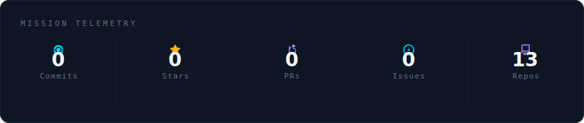

  

 

  

 

  

 

  

 

<strong>More about me</strong>

 

Building tools that make developers' lives easier.
Passionate about distributed systems, developer experience, and the open-source ecosystem.

**Currently at** Olivantel Technology - São Paulo, Brazil

 

  
  
  

